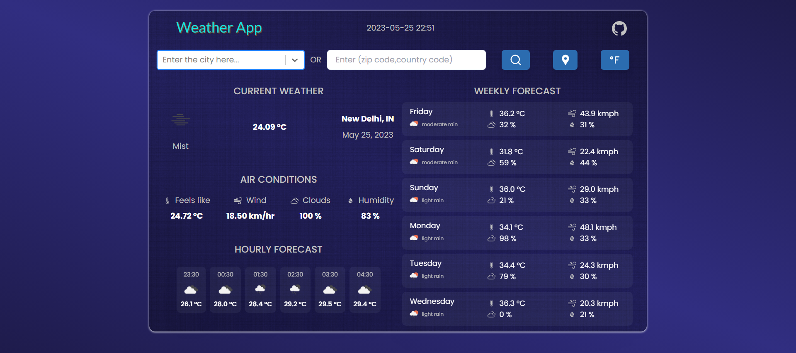

# Weather App


A Web Application which shows the current day's temperature and other details like wind speed, humidity etc. of the entered city or zip code. It also shows hourly forecast of the day of next 6 hours and similarly, it also shows weekly forecast of the location. A user can search these relevant information by entering a city name or zip code of a particular location they want to. Weather details can also be retrieve for their current location. User can switch the units of relevant details which they want it to be shown metric or imperial.


## Live Demo



Live Website: [Weather App](https://weather-app-react-vaibhav.netlify.app/)
## Getting Started
- Make you have `Node.js` and `npm` installed in your system.
- You need an API key from [OpenWeatherMap](https://openweathermap.org/). After creating an account, [grab your key](https://home.openweathermap.org/api_keys).
- Then, under the `src` directory, go to `WeatherFetchData` and replace `API_KEY` with your OpenWeatherMap API Key or add it to your .env file with name `REACT_APP_API_KEY`.
## Installation

- Clone the repository:

```bash
git clone https://github.com/vaibhav797/weather-app.git

```

- Install the packages using the command `npm install`.
    
## Used Libraries
- `react-js`
- `chakra-ui`
- `tailwind css`
- `react-icons`
## Deployment

- To deploy this project run `npm run build`.
- An optimised `.build` will be created and used for deployment.
- Create an account in Netlify deploying website and click add new project and drag and drop `.build` file into it.
- Project will be published and can be viewed through the link it has produced from anywhere.


## Environment Variables

To run this project, you will need to add your openweather api key in environment variables to your .env file.

`REACT_APP_API_KEY`


## Features

- Current Location Weather forecasting.
- Toggle units between metric or imperial.
- Search by city name or zip code.
- Weather Forecast for next 6 hours and next 6 days.

